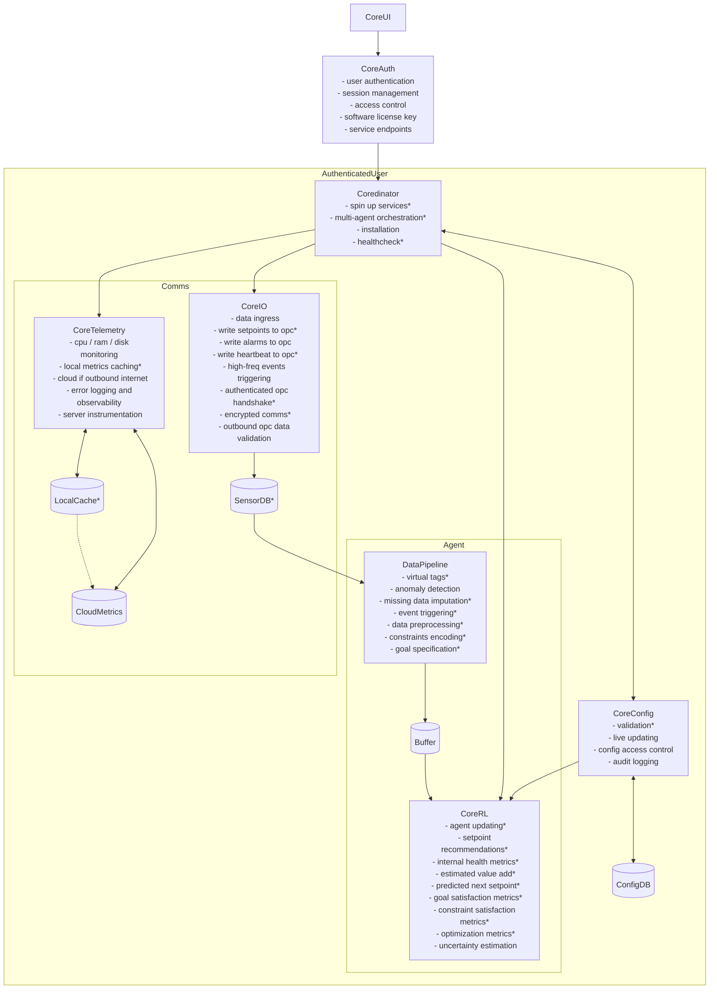

## Backend system architecture diagram

- Functions with an `*` are completed to an MVP level
- `CoreUI` is not part of the backend, but is represented here to communicate its communication pathway into the backend.

