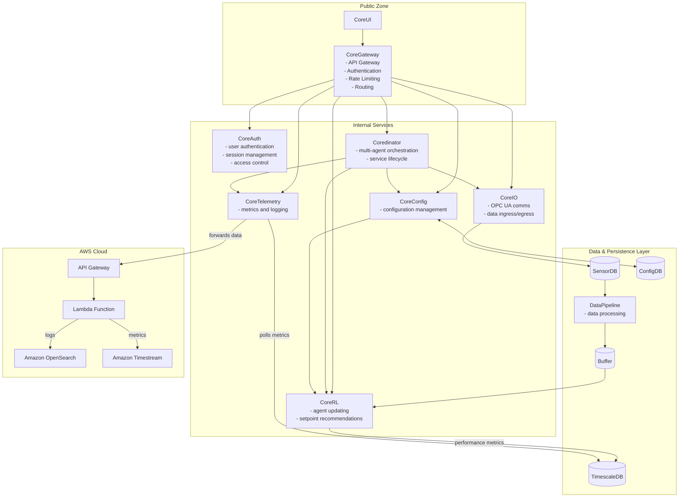

# CoreRL Technical Specification

**Version**: 1.0
**Date**: August 22, 2025
**Status**: Draft

## Table of Contents

1. [Executive Summary](#executive-summary)
2. [System Architecture Overview](#system-architecture-overview)
3. [Technology Stack](#technology-stack)
4. [Microservices Documentation](#microservices-documentation)
5. [Development Environment](#development-environment)
6. [Internal Tools and Practices](#internal-tools-and-practices)
7. [Deployment and Operations](#deployment-and-operations)
8. [Security Considerations](#security-considerations)
9. [Performance and Scalability](#performance-and-scalability)
10. [Appendices](#appendices)

---

## Executive Summary

CoreRL is a reinforcement learning system engineered for industrial control and process optimization. It provides real-time, data-driven decision-making for complex industrial environments. The system is built on a distributed microservices architecture that prioritizes reliability, performance, and integration with existing control systems.

### Key Features
- **Real-time Decision Making**: Sub-second response times for control loops.
- **Multi-Agent Coordination**: Orchestration between multiple RL agents.
- **Industrial Integration**: Native OPC UA support.
- **High-Performance Computing**: JAX-based neural networks.
- **Scalable Architecture**: Microservices design.
- **Production-Ready**: Includes monitoring, logging, and deployment tools.
- **Supervisory Control**: High-level optimization of lower-level controllers.
- **Low-Configuration**: Minimal configuration and setup complexity.
- **Continuous Adaptation**: Agents continually learn, adapt, and improve.

---

## System Architecture Overview

The CoreRL system uses a distributed microservices architecture for industrial environments, prioritizing reliability and real-time performance.

### Architecture Principles
1. **Separation of Concerns**: Each service has a single responsibility.
2. **Async-First Design**: Services are designed for non-blocking, high-throughput operations.
3. **Fault Tolerance**: Services handle failures gracefully.
4. **Observability**: System includes logging, metrics, and health monitoring.
5. **Security by Design**: Implements authentication, authorization, and encrypted communications.

---

## Technology Stack

### Core Technologies

| Component | Technology | Purpose |
|-----------|------------|---------|
| **Runtime** | Python | Primary programming language |
| **Package Manager** | uv | Fast Python package management |
| **ML Framework** | JAX | High-performance numerical computing |
| **Neural Networks** | Haiku | JAX-based neural network library |
| **Web Framework** | FastAPI | REST API services |
| **Database** | TimescaleDB | Time-series data storage |
| **Message Broker** | ZeroMQ | Inter-service messaging |
| **Industrial Comms** | asyncua | OPC UA communication |

### Supporting Technologies

| Component | Technology | Purpose |
|-----------|------------|---------|
| **Data Processing** | Pandas, NumPy, SciPy | Data manipulation and analysis |
| **Configuration** | Pydantic, PyYAML | Type-safe configuration management |
| **Monitoring** | Grafana | Metrics visualization |
| **Containerization** | Docker, Docker Compose | Service packaging and orchestration |
| **Code Quality** | Ruff, Pyright, Pylint | Linting, formatting, and type checking |
| **Testing** | pytest | Unit and integration testing |

---

## Microservices Documentation

### [CoreGateway Service](tech_spec/coregateway.md)
Public-facing API Gateway for the CoreRL platform.

### [CoreRL Service](tech_spec/corerl.md)
The main reinforcement learning engine providing AI-powered decision making capabilities.

### [CoreIO Service](tech_spec/coreio.md)
Industrial I/O service handling OPC UA communication and data exchange with control systems.

### [Coredinator Service](tech_spec/coredinator.md)
Orchestration service managing multi-agent coordination and service lifecycle management.

### [CoreTelemetry Service](tech_spec/coretelemetry.md)
The telemetry service for the CoreRL platform.

### [Shared Libraries](tech_spec/libraries.md)
Common libraries providing reusable functionality across all services.

### [Research Platform](tech_spec/research.md)
Experimental environment for algorithm development and performance benchmarking.

---

## Deployment and Operations

### Orchestration

#### Development Environment
- **Tool**: Docker Compose
- **Services**: All services with mock external dependencies
- **Hot Reload**: Development volumes for code changes

#### Production Environment
- **Orchestrator**: `coredinator` manages the lifecycle of services and agents.
- **Operating Systems**: Compatible with Linux and Windows servers.
  - **Linux**: `coredinator` runs as a `systemd` service.
  - **Windows**: `coredinator` runs as a native Windows service.
- **Deployment Model**: On-premise deployment with a dedicated agent instance per industrial process.

### Monitoring and Observability

#### Metrics Collection
- **Process Data**: Collection and historization of industrial process data.
- **Data Health**: Metrics monitoring the quality and integrity of incoming data.
- **Agent Health**: Health indicators for each running RL agent.
- **Agent Performance**: Key performance indicators for agent decision-making.
- **Business Value**: Metrics tracking the economic and operational value generated.

#### Logging
- **Structured Logging**: JSON format with correlation IDs
- **Centralized Collection**: All logs are sent to the `CoreTelemetry` service, which forwards them to a central data store in the cloud.
- **Log Levels**: DEBUG, INFO, WARNING, ERROR, CRITICAL

#### Health Monitoring
- **Health Endpoints**: `/healthcheck` for each service
- **Dependency Checks**: Database, external service connectivity
- **OPC-UA Watchdog**: A signal that constantly writes new values to an OPC tag to indicate the `corerl` service is still running.

### Backup and Recovery

#### Data Backup
- **Database**: Automated TimescaleDB backups
- **Configuration**: Git-based configuration versioning
- **Model Checkpoints**: Periodic RL model snapshots
- **Offsite Backups**: When internet connectivity is available, historical data is backed up to an offsite cloud service provider (e.g., AWS).

## Deployment Strategy

The system uses a blue/green deployment strategy for agent upgrades, managed by the `coredinator` service. A new agent version is deployed to a staging environment, and traffic is switched after successful health and validation checks. `coredinator` handles automated rollbacks if issues are detected.

In case of data corruption, the system reverts to the last stable agent version. Transient data, like neural network weights, is purged and reconstructed from the process data historian.

---

## Security Considerations

### Authentication and Authorization

#### Service-to-Service Authentication
- **Method**: JWT tokens with service identity
- **Rotation**: Automatic key rotation every 30 days
- **Validation**: Signature verification and claims validation

#### User Authentication
- **Method**: OAuth 2.0 / OpenID Connect
- **Session Management**: Secure session cookies with CSRF protection
- **Role-Based Access**: Granular permissions per service endpoint

### Data Security

#### Encryption
- **In Transit**: TLS 1.3 for all external communications
- **At Rest**: Database-level encryption for sensitive data
- **Key Management**: External key management service (KMS)

#### Data Privacy
- **Data Retention**: Automated purging based on retention policies
- **Audit Logging**: All manual data access and modifications logged

### Industrial Security

#### OPC UA Security
- **Authentication**: X.509 certificates for OPC UA connections
- **Encryption**: OPC UA encryption for industrial communications
- **Network Segmentation**: Isolated networks for industrial traffic

---

## Performance and Scalability

As an on-premise, local-first application, performance and scalability are focused on efficient use of local hardware.

### Performance Targets
- **Inference Time**: Agent decision-making completes in < 1s.
- **Background Learning**: Supports up to 10 agents training concurrently on an 8-core server.

### Resource Requirements
- **RAM**: Each agent requires at least 8GB of dedicated RAM.
- **Disk Space**: A minimum of 1TB of disk space is required for data historization. More disk space allows for longer data retention.

### Performance Testing
- **Benchmarks**: Regular performance benchmarks are conducted for the agent and data pipeline.
- **Endurance Testing**: Long-running tests are performed to ensure system stability over extended periods.

---

## Internal Development Practices

See [internal_practices.md](tech_spec/internal_practices.md) for internal tools, workflows, and code quality standards. This document is for internal use only.

---

## Appendices

### Appendix A: Configuration Schema Reference
[Link to detailed configuration schemas](tech_spec/config_schemas.md)

### Appendix B: API Documentation (TODO)
[Link to OpenAPI specifications](tech_spec/api_docs.md)

### Appendix C: Performance Benchmarks (TODO)
[Link to performance test results](tech_spec/benchmarks.md)

### Appendix D: Security Audit Reports (TODO)
[Link to security assessment results](tech_spec/security_audit.md)

---

*This document is maintained by the CoreRL engineering team and is updated with each major release.*
