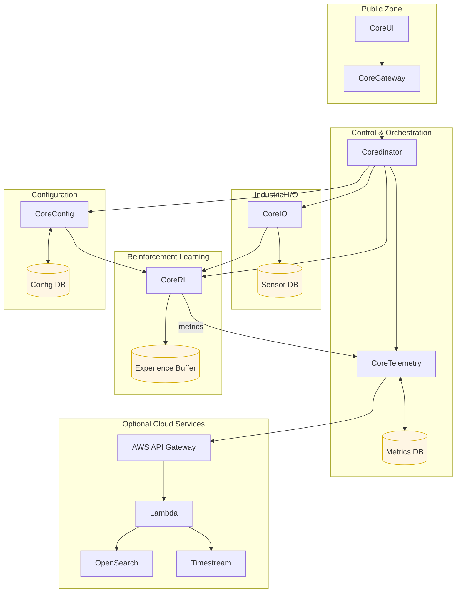

# RLTune Technical Specification

**Version**: 1.0
**Date**: August 22, 2025
**Status**: Draft

## Table of Contents

1. [Executive Summary](#executive-summary)
2. [Design Principles](#design-principles)
3. [System Architecture Overview](#system-architecture-overview)
4. [Technology Stack](#technology-stack)
5. [Microservices Documentation](#microservices-documentation)
6. [Development Environment](#development-environment)
7. [Internal Tools and Practices](#internal-tools-and-practices)
8. [Deployment and Operations](#deployment-and-operations)
9. [Security Considerations](#security-considerations)
10. [Performance and Scalability](#performance-and-scalability)
11. [Appendices](#appendices)

---

## Executive Summary

RLTune is a reinforcement learning system engineered for industrial control and process optimization. It provides real-time, data-driven decision-making for complex industrial environments. The system is built on a distributed microservices architecture that prioritizes reliability, performance, and integration with existing control systems.

### Key Features
- **Real-time Decision Making**: Sub-second response times for control loops.
- **Multi-Agent Coordination**: Orchestration between multiple RL agents.
- **Industrial Integration**: Native OPC UA support.
- **High-Performance Computing**: JAX-based neural networks.
- **Scalable Architecture**: Microservices design.
- **Production-Ready**: Includes monitoring, logging, and deployment tools.
- **Supervisory Control**: High-level optimization of lower-level controllers.
- **Low-Configuration**: Minimal configuration and setup complexity.
- **Continuous Adaptation**: Agents continually learn, adapt, and improve.

---

## Design Principles

1. **Local-First Operation**: Core control logic, online learning, and essential data storage must continue operating when the site is fully isolated from the internet. Cloud or remote services may enhance analytics, fleet management, or archival retention, but they are explicitly treated as optional amplifiers rather than safety or availability prerequisites. Design choices that would create a hard dependency on remote connectivity are rejected.
2. **Single Ingress & Central Dispatch**: `CoreGateway` focuses on ingress concerns—authentication, basic request validation, rate limiting, and uniform logging—then forwards every internal call to `Coredinator`. `Coredinator` exclusively owns internal routing, `agent_id → instance` resolution, and dispatch policies.
3. **Clear Service Boundaries**: Each service owns one cohesive responsibility (I/O, decision-making, configuration, telemetry) and publishes a narrowly scoped, versioned API. Any cross-cutting workflow is composed through those public contracts rather than by reaching into another service’s internals, reducing hidden coupling and making upgrades safer.
4. **Deterministic & Observable Control**: Low-latency control paths remain non-blocking. Comprehensive instrumentation—metrics, structured logs with correlation IDs, traces where applicable, and explicit health endpoints—enables rapid fault isolation and regression detection during both development and incident response.
5. **Security by Design, Iterative Hardening**: We begin with foundational controls: JWT authentication, least privilege authorization, encrypted transport, and auditable actions. Additional layers—message signing, mutual service authentication, network segmentation, secrets rotation automation—are added incrementally as risk, regulatory pressure, or system maturity dictates, avoiding premature complexity while preserving a clear roadmap to higher assurance.
6. **Resilience & Fail-Fast**: The system assumes a single-instance deployment and prioritizes fast local recovery, graceful degradation, and protective mechanisms (circuit breakers, bounded retries with backoff, timeouts) over horizontal scaling concerns. Failures surface quickly and transparently so operators can intervene before cascading effects emerge, and fallback modes prefer partial functionality to total outage.
7. **Typed & Versioned Config**: All configuration is defined by strongly typed schemas validated strictly at load time (rejecting ambiguous or partial input early). Versioned migrations (with forward + backward compatibility where feasible) ensure configuration evolution is deliberate, reviewable, and reproducible across environments and during incident rollbacks.
8. **Lean Data & Retention**: We retain only the data that demonstrably contributes to model performance improvement, audit/auditability requirements, or compliance obligations. Explicit retention windows, lifecycle policies, and size guards prevent unbounded local growth; data that no longer yields marginal value is summarized or purged to keep storage predictable and recovery times short.
9. **Modular & Evolvable Learning / Deployment**: Reinforcement learning components (policy networks, value estimators, replay buffers, feature pipelines) are pluggable behind stable interfaces, allowing experimentation without destabilizing production. Deployment artifacts remain backward-compatible to support blue/green swaps, controlled canaries, and rapid rollback with minimal orchestration changes.
10. **Operational Transparency**: Every material decision path (state → action selection), model update event, and dispatch routing choice produces traceable signals—logs, metrics, or structured audit records. This provenance trail enables post-incident reconstruction, performance tuning, and defensibility for external stakeholders (e.g., safety or compliance reviewers).

## System Architecture Overview

The RLTune platform uses a distributed microservices architecture for industrial environments, prioritizing reliability and real-time performance.

### (Removed Redundant Architecture Principles)

---

## Technology Stack

### Core Technologies

| Component | Technology | Purpose |
|-----------|------------|---------|
| **Runtime** | Python | Primary programming language |
| **Package Manager** | uv | Fast Python package management |
| **ML Framework** | JAX | High-performance numerical computing |
| **Neural Networks** | Haiku | JAX-based neural network library |
| **Web Framework** | FastAPI | REST API services |
| **Database** | TimescaleDB | Time-series data storage |
| **Message Broker** | ZeroMQ | Inter-service messaging |
| **Industrial Comms** | asyncua | OPC UA communication |

### Supporting Technologies

| Component | Technology | Purpose |
|-----------|------------|---------|
| **Data Processing** | Pandas, NumPy, SciPy | Data manipulation and analysis |
| **Configuration** | Pydantic, PyYAML | Type-safe configuration management |
| **Monitoring** | Grafana | Metrics visualization |
| **Containerization** | Docker, Docker Compose | Service packaging and orchestration |
| **Code Quality** | Ruff, Pyright, Pylint | Linting, formatting, and type checking |
| **Testing** | pytest | Unit and integration testing |

---

## Microservices Documentation

### [CoreGateway Service](tech_spec/coregateway.md)
Public-facing API Gateway for the RLTune platform.

### [CoreRL Service](tech_spec/corerl.md)
The main reinforcement learning microservice (CoreRL) providing AI-powered decision making capabilities within the RLTune platform.

### [CoreIO Service](tech_spec/coreio.md)
Industrial I/O service handling OPC UA communication and data exchange with control systems for RLTune.

### [Coredinator Service](tech_spec/coredinator.md)
Orchestration service managing multi-agent coordination and service lifecycle management across the RLTune deployment.

### [CoreTelemetry Service](tech_spec/coretelemetry.md)
The telemetry service for the RLTune platform.

### [Shared Libraries](tech_spec/libraries.md)
Common libraries providing reusable functionality across all RLTune services.

### [Research Platform](tech_spec/research.md)
Experimental environment for algorithm development and performance benchmarking.

---

## Deployment and Operations

### Orchestration

#### Development Environment
- **Tool**: Docker Compose
- **Services**: All services with mock external dependencies
- **Hot Reload**: Development volumes for code changes

#### Production Environment
- **Orchestrator**: `coredinator` manages the lifecycle of services and agents.
- **Operating Systems**: Compatible with Linux and Windows servers.
  - **Linux**: `coredinator` runs as a `systemd` service.
  - **Windows**: `coredinator` runs as a native Windows service.
- **Deployment Model**: On-premise deployment with a dedicated agent instance per industrial process.

### Monitoring and Observability

#### Metrics Collection
- **Process Data**: Collection and historization of industrial process data.
- **Data Health**: Metrics monitoring the quality and integrity of incoming data.
- **Agent Health**: Health indicators for each running RL agent.
- **Agent Performance**: Key performance indicators for agent decision-making.
- **Business Value**: Metrics tracking the economic and operational value generated.

#### Logging
- **Structured Logging**: JSON format with correlation IDs
- **Centralized Collection**: All logs are sent to the `CoreTelemetry` service, which forwards them to a central data store in the cloud.
- **Log Levels**: DEBUG, INFO, WARNING, ERROR, CRITICAL

#### Health Monitoring
- **Health Endpoints**: `/healthcheck` for each service
- **Dependency Checks**: Database, external service connectivity
- **OPC-UA Watchdog**: A signal that constantly writes new values to an OPC tag to indicate the `CoreRL` service is still running.

### Backup and Recovery

#### Data Backup
- **Database**: Automated TimescaleDB backups
- **Configuration**: Git-based configuration versioning
- **Model Checkpoints**: Periodic RL model snapshots
- **Offsite Backups**: When internet connectivity is available, historical data is backed up to an offsite cloud service provider (e.g., AWS).

## Deployment Strategy

The RLTune system uses a blue/green deployment strategy for agent upgrades, managed by the `coredinator` service. A new agent version is deployed to a staging environment, and traffic is switched after successful health and validation checks. `coredinator` handles automated rollbacks if issues are detected.

In case of data corruption, the system reverts to the last stable agent version. Transient data, like neural network weights, is purged and reconstructed from the process data historian.

---

## Security Considerations

### Authentication and Authorization

#### Service-to-Service Authentication
- **Method**: JWT tokens with service identity
- **Rotation**: Automatic key rotation every 30 days
- **Validation**: Signature verification and claims validation

#### User Authentication
- **Method**: OAuth 2.0
- **Session Management**: Secure session cookies with CSRF protection
- **Role-Based Access**: Granular permissions per service endpoint

### Data Security

#### Encryption
- **In Transit**: TLS 1.3 for all external communications
- **At Rest**: Database-level encryption for sensitive data

#### Data Privacy
- **Data Retention**: Automated purging based on retention policies
- **Audit Logging**: All manual data access and modifications logged

### Industrial Security

#### OPC UA Security
- **Authentication**: X.509 certificates for OPC UA connections
- **Encryption**: OPC UA encryption for industrial communications
- **Network Segmentation**: Isolated networks for industrial traffic

---

## Performance and Scalability

As an on-premise, local-first application, RLTune performance and scalability are focused on efficient use of local hardware.

### Performance Targets
- **Inference Time**: Agent decision-making completes in < 1s.
- **Background Learning**: Supports up to 10 agents training concurrently on an 8-core server.

### Resource Requirements
- **RAM**: Each agent requires at least 8GB of dedicated RAM.
- **Disk Space**: A minimum of 100GB of disk space is required for data historization. More disk space allows for longer data retention.

### Performance Testing
- **Benchmarks**: Regular performance benchmarks are conducted for the agent and data pipeline.
- **Endurance Testing**: Long-running tests are performed to ensure system stability over extended periods.

---

## Internal Development Practices

See [internal_practices.md](tech_spec/internal_practices.md) for internal tools, workflows, and code quality standards. This document is for internal use only.

---

## Appendices

### Appendix A: Configuration Schema Reference
[Link to detailed configuration schemas](tech_spec/config_schemas.md)

### Appendix B: API Documentation (TODO)
[Link to OpenAPI specifications](tech_spec/api_docs.md)

### Appendix C: Performance Benchmarks (TODO)
[Link to performance test results](tech_spec/benchmarks.md)

### Appendix D: Security Audit Reports (TODO)
[Link to security assessment results](tech_spec/security_audit.md)
