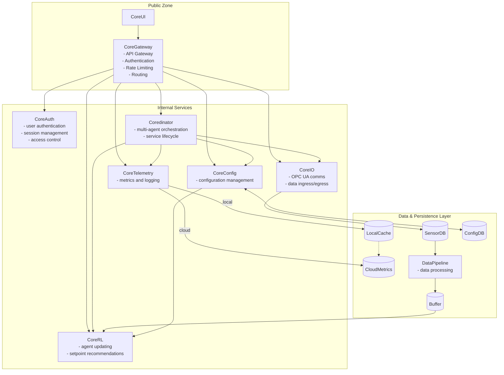

# CoreRL Technical Specification

**Version**: 1.0
**Date**: August 22, 2025
**Status**: Draft

## Table of Contents

1. [Executive Summary](#executive-summary)
2. [System Architecture Overview](#system-architecture-overview)
3. [Technology Stack](#technology-stack)
4. [Microservices Documentation](#microservices-documentation)
5. [Development Environment](#development-environment)
6. [Internal Tools and Practices](#internal-tools-and-practices)
7. [Deployment and Operations](#deployment-and-operations)
8. [Security Considerations](#security-considerations)
9. [Performance and Scalability](#performance-and-scalability)
10. [Appendices](#appendices)

---

## Executive Summary

CoreRL is a sophisticated reinforcement learning system designed for industrial control and optimization applications. The system provides AI-powered decision-making capabilities for complex industrial processes, with a focus on energy and utilities management.

### Key Features
- **Real-time Decision Making**: Sub-second response times for industrial control
- **Multi-Agent Coordination**: Orchestrated coordination between multiple RL agents
- **Industrial Integration**: Native OPC UA support for seamless industrial system integration
- **High-Performance Computing**: JAX-based neural networks for optimal computational efficiency
- **Scalable Architecture**: Microservices design supporting horizontal scaling
- **Production-Ready**: Comprehensive monitoring, logging, and deployment tools

---

## System Architecture Overview

The CoreRL system implements a distributed microservices architecture optimized for industrial environments. The architecture prioritizes reliability, real-time performance, and integration with existing industrial control systems.

### Architecture Principles
1. **Separation of Concerns**: Each service has a single, well-defined responsibility
2. **Async-First Design**: All services built for non-blocking, high-throughput operations
3. **Fault Tolerance**: Services designed to gracefully handle failures and continue operation
4. **Observability**: Comprehensive logging, metrics, and health monitoring
5. **Security by Design**: Authentication, authorization, and encrypted communications

---

## Technology Stack

### Core Technologies

| Component | Technology | Purpose |
|-----------|------------|---------|
| **Runtime** | Python | Primary programming language |
| **Package Manager** | uv | Fast Python package management |
| **ML Framework** | JAX | High-performance numerical computing |
| **Neural Networks** | Haiku | JAX-based neural network library |
| **Web Framework** | FastAPI | REST API services |
| **Database** | TimescaleDB | Time-series data storage |
| **Message Broker** | ZeroMQ | Inter-service messaging |
| **Industrial Comms** | asyncua | OPC UA communication |

### Supporting Technologies

| Component | Technology | Purpose |
|-----------|------------|---------|
| **Data Processing** | Pandas, NumPy, SciPy | Data manipulation and analysis |
| **Configuration** | Pydantic, PyYAML | Type-safe configuration management |
| **Monitoring** | Grafana, Telegraf | Metrics visualization and collection |
| **Containerization** | Docker, Docker Compose | Service packaging and orchestration |
| **Code Quality** | Ruff, Pyright, Pylint | Linting, formatting, and type checking |
| **Testing** | pytest | Unit and integration testing |

---

## Microservices Documentation

### [CoreGateway Service](tech_spec/coregateway.md)
Public-facing API Gateway for the CoreRL platform.

### [CoreRL Service](tech_spec/corerl.md)
The main reinforcement learning engine providing AI-powered decision making capabilities.

### [CoreIO Service](tech_spec/coreio.md)
Industrial I/O service handling OPC UA communication and data exchange with control systems.

### [Coredinator Service](tech_spec/coredinator.md)
Orchestration service managing multi-agent coordination and service lifecycle management.

### [Shared Libraries](tech_spec/libraries.md)
Common libraries providing reusable functionality across all services.

### [Research Platform](tech_spec/research.md)
Experimental environment for algorithm development and performance benchmarking.

---

## Deployment and Operations

### Orchestration

#### Development Environment
- **Tool**: Docker Compose
- **Services**: All services with mock external dependencies
- **Hot Reload**: Development volumes for code changes

#### Production Environment
- **Orchestrator**: `coredinator` manages the lifecycle of services and agents.
- **Operating Systems**: Compatible with both Linux and Windows servers.
  - **Linux**: `coredinator` is installed as a `systemd` service.
  - **Windows**: `coredinator` is installed as a native Windows service.
- **Deployment Model**: On-premise deployment, with a dedicated agent instance for each industrial process.

### Monitoring and Observability

#### Metrics Collection
- **Process Data**: Collection and historization of industrial process data.
- **Data Health**: Metrics monitoring the quality and integrity of incoming data.
- **Agent Health**: Health indicators for each running RL agent.
- **Agent Performance**: Key performance indicators for agent decision-making.
- **Business Value**: Metrics tracking the economic and operational value generated.

#### Logging
- **Structured Logging**: JSON format with correlation IDs
- **Centralized Collection**: ELK stack or similar
- **Log Levels**: DEBUG, INFO, WARNING, ERROR, CRITICAL

#### Health Monitoring
- **Health Endpoints**: `/healthcheck` for each service
- **Dependency Checks**: Database, external service connectivity
- **OPC-UA Watchdog**: A signal that constantly writes new values to an OPC tag to indicate the `corerl` service is still running.

### Backup and Recovery

#### Data Backup
- **Database**: Automated TimescaleDB backups
- **Configuration**: Git-based configuration versioning
- **Model Checkpoints**: Periodic RL model snapshots
- **Offsite Backups**: When internet connectivity is available, historical data is backed up to an offsite cloud service provider (e.g., AWS).

## Deployment Strategy

The system employs a blue/green deployment methodology for agent upgrades, orchestrated by the `coredinator` service. A new agent version is deployed to a staging (green) environment while the production (blue) environment remains active. Upon successful health and validation checks, traffic is switched to the green environment. The `coredinator` facilitates automated rollback to the previous version if issues are detected.

For data integrity, the system reverts to the last known stable agent version in case of data corruption. Transient data, including neural network weights, is purged and reconstructed from the process data historian to ensure rapid system recovery.

---

## Security Considerations

### Authentication and Authorization

#### Service-to-Service Authentication
- **Method**: JWT tokens with service identity
- **Rotation**: Automatic key rotation every 30 days
- **Validation**: Signature verification and claims validation

#### User Authentication
- **Method**: OAuth 2.0 / OpenID Connect
- **Session Management**: Secure session cookies with CSRF protection
- **Role-Based Access**: Granular permissions per service endpoint

### Data Security

#### Encryption
- **In Transit**: TLS 1.3 for all external communications
- **At Rest**: Database-level encryption for sensitive data
- **Key Management**: External key management service (KMS)

#### Data Privacy
- **Data Retention**: Automated purging based on retention policies
- **Audit Logging**: All manual data access and modifications logged

### Industrial Security

#### OPC UA Security
- **Authentication**: X.509 certificates for OPC UA connections
- **Encryption**: OPC UA encryption for industrial communications
- **Network Segmentation**: Isolated networks for industrial traffic

---

## Performance and Scalability

As an on-premise, local-first application, our performance and scalability are focused on efficient use of local hardware resources.

### Performance Targets
- **Inference Time**: Agent decision-making (inference) must complete in < 1s.
- **Background Learning**: The system supports up to 10 agents training concurrently on a modern 8-core server.

### Resource Requirements
- **RAM**: Each agent requires a minimum of 8GB of dedicated RAM.
- **Disk Space**: A minimum of 1TB of disk space is required for data historization. Increased disk space allows for longer data retention periods.

### Performance Testing
- **Benchmarks**: Regular performance benchmarks are conducted for the agent and data pipeline.
- **Endurance Testing**: Long-running tests are performed to ensure system stability over extended periods.

---

## Internal Development Practices

See [internal_practices.md](tech_spec/internal_practices.md) for internal tools, workflows, and code quality standards. This section is for internal use only and should not be shared externally.

---

## Appendices

### Appendix A: Configuration Schema Reference
[Link to detailed configuration schemas](tech_spec/config_schemas.md)

### Appendix B: API Documentation
[Link to OpenAPI specifications](tech_spec/api_docs.md)

### Appendix C: Troubleshooting Guide
[Link to common issues and solutions](tech_spec/troubleshooting.md)

### Appendix D: Performance Benchmarks
[Link to performance test results](tech_spec/benchmarks.md)

### Appendix E: Security Audit Reports
[Link to security assessment results](tech_spec/security_audit.md)

---

*This document is maintained by the CoreRL engineering team and is updated with each major release.*
