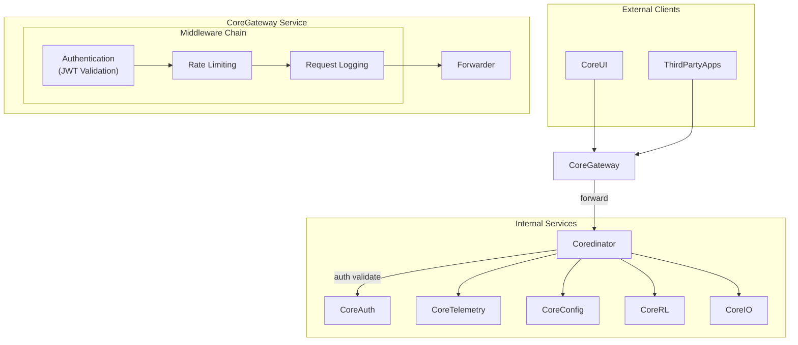
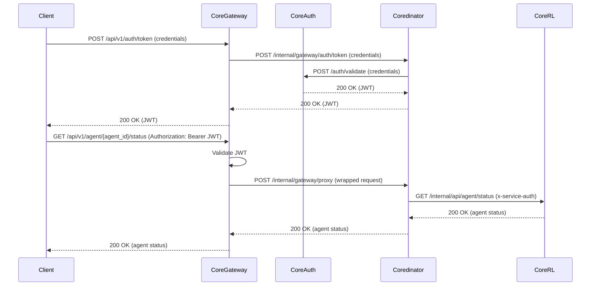

# CoreGateway Service Technical Specification

**Version**: 1.0
**Date**: August 24, 2025
**Status**: Draft

## Summary — Purpose • Scope • Key decisions

- **Purpose**: Provides a single, secure, public REST API ingress for the CoreRL platform. The gateway enforces authentication and rate-limits, then forwards all authorized traffic to `Coredinator`, which is the sole component responsible for internal service routing and agent instance resolution.
- **Scope**: External ingress (TLS termination optional), authentication enforcement (via CoreAuth), rate limiting, API versioning, request/response normalization, forwarding to `Coredinator`. Protocol translation (e.g., HTTP <> ZeroMQ or other internal transports) is explicitly delegated to `Coredinator` or the destination service façade and is not performed in the gateway.
- Key decisions:
  - `CoreGateway` performs local JWT validation but does not look up internal service locations; it forwards to `Coredinator`.
  - `Coredinator` owns agent_id -> (CoreRL/CoreIO/etc.) instance mapping and dynamic dispatch.
  - Keep gateway stateless for simplicity.
  - Minimize translation layers; prefer transparent pass-through after auth & rate-limit.

---

## Spec outline

- Context: Edge-of-network reverse-proxy/gateway for CoreRL
-- Primary use-cases:
  - UI / external client obtains JWT via `/api/v1/auth/token` (forwarded to CoreAuth via Coredinator path).
  - Client invokes `/api/v1/agent/*` (and other domain endpoints); gateway authenticates + rate-limits and forwards to `Coredinator` on an internal consolidation endpoint.
- NFRs:
  - TLS termination for external traffic
  - P95 API latency < 500ms (gateway overhead target < 50ms)
  - Rate limit: default 100 requests/min; adjustable per-route
  - High availability: readiness/liveness probes for `coredinator`
- Components & responsibilities:
  - HTTP server (FastAPI + ASGI worker)
  - Middleware chain: Auth, Rate-limiter, Logging, Correlation IDs, Request validation
  - Forwarder (wraps and forwards requests to `Coredinator` internal endpoint)
- Data flows:
  - Client -> Gateway (TLS) -> Auth middleware -> Forwarder -> Coredinator (routing + dispatch) -> Target service -> Coredinator -> Gateway -> Client
- Deployment:
  - Windows and linux executables managed by `coredinator`
- Assumptions:
  - `CoreAuth` issues JWTs the gateway can validate
  - Internal services are available on cluster network (service names resolvable)
- Acceptance criteria:
  - Gateway forwards /api/v1/auth/token via Coredinator and returns JWT successfully
  - Gateway blocks unauthorized requests based on role
  - Rate-limits enforced and reported
  - Gateway forwards application requests only to Coredinator (no direct backend calls)

---

## Component diagram

---

## Sequence: authentication + request flow

---

## Configuration & Routing

Routing logic (dynamic internal service selection) is owned by `Coredinator`. The gateway maintains only a minimal forward table (e.g., public path -> forward endpoint) and does not enumerate backend services. Internal path resolution, agent_id mapping, and service selection are out of scope here.

---

## API contract & example endpoints

- Public prefix: `/api/v1/`
- Minimal endpoints:
  - `POST /api/v1/auth/token` -> forwards to CoreAuth -> returns JWT
    - `GET /api/v1/agent/{agent_id}/status` -> forwarded to Coredinator (queries CoreRL instance for that agent_id)
    - `GET /api/v1/agent/{agent_id}/config/current` -> forwarded to Coredinator (dispatches to CoreConfig scoped to agent_id)
  - Path parameter: `agent_id` is a stable identifier assigned at agent creation; gateway treats it as opaque—resolution occurs only inside Coredinator.

Request headers:
- `Authorization: Bearer <jwt>` for protected routes
- `X-Correlation-ID` optionally supplied or generated by the gateway
- `X-Forwarded-For` added for client IP preservation

Responses:
- For proxied 2xx responses, gateway forwards body and essential headers.
- For internal error codes, gateway normalizes errors:
  - Internal service 5xx -> gateway returns 502 Bad Gateway and logs details.
  - Unauthorized or invalid token -> 401
  - Forbidden -> 403
  - Rate-limited -> 429

---

## Authentication patterns

The gateway uses Local JWT validation.
- Gateway receives JWT, validates signature and claims with known public keys (or JWK URI).
- Check expiry, issuer, audience, and roles/permissions in token claims as required.
- This method is fast, with no network roundtrip per request.

Recommendation: Use JWT signed by `CoreAuth` with a short-ish TTL (e.g., 15–60 minutes) and a revocation list or key-rotation strategy coordinated with `CoreAuth`.

---

## Rate limiting & debouncing

- Implement global rate limits using an in-memory sliding window or token-bucket implementation. Per-user or per-IP limits are not required for this on-premise architecture.
- Debouncing: endpoints that trigger expensive operations should be subject to a short debounce window to coalesce duplicate requests.

---

## Observability & metrics

**Metrics**: The gateway pushes key operational metrics to `CoreTelemetry` (either directly or via a lightweight collector). This includes:
  - `request_total`, `request_duration_seconds` (histogram), `request_size_bytes`, `response_size_bytes`
  - `auth_validation_total`, `auth_failures_total`
  - `rate_limited_total`
  - `proxied_5xx_total`
- **Logging**: Structured JSON logs with correlation id, request path, method, response code, latency, and user id are emitted for centralized collection.

---

## Deployment & operations

- **Orchestration**: `CoreGateway` is managed by `coredinator`, which handles its lifecycle (start, stop, restart).
- **Installation**: Deployed as a bare-metal executable on Windows and Linux.
- **Health Checks**: `coredinator` monitors `CoreGateway` via a `/healthcheck` endpoint.
- **Secrets Management**: JWT verification keys and other secrets are managed via encrypted configuration files.

---

## Error handling & resilience

- Circuit breaker focuses on the single upstream (`Coredinator`) rather than many individual services.
- Configurable timeout for forward calls (default 2s) with backoff to a short fail-fast threshold if Coredinator degrades.
- Retries: idempotent GET/HEAD/PUT forward requests only; do not retry POST by default.

---

## Pseudocode / API contract (forwarding flow)

Inputs:
  - HTTP request: method, path, headers, body
  - Forward map (public prefix -> Coredinator consolidation endpoint)
Outputs:
  - HTTP response to client
Errors:
  - 401 unauthorized
  - 403 forbidden
  - 429 rate limit
  - 502/503 upstream errors

Simplified flow:
1. Receive request
2. If auth path -> forward to Coredinator auth endpoint
3. Else validate JWT
4. Rate limit check
5. Wrap request (original path, method, body, claims, correlation id)
6. POST to Coredinator consolidation endpoint
7. Stream/return response to client

---

## Acceptance tests (minimal)

1. Auth flow:
  - POST /api/v1/auth/token -> gateway forwards (via Coredinator -> CoreAuth) and returns JWT.
   - GET protected endpoint without token -> gateway returns 401.
   - GET protected endpoint with valid token -> gateway proxies request to target and returns 200.

2. Rate limiting:
   - Send N requests over limit -> gateway returns 429 for the excess requests.

3. Forwarding:
  - Request GET /api/v1/agent/{agent_id}/status -> gateway wraps request (including path param) and forwards to Coredinator; Coredinator selects appropriate CoreRL instance.
  - Request GET /api/v1/agent/{agent_id}/config/current -> gateway forwards; Coredinator dispatches to CoreConfig scoped by agent_id.

4. Error handling:
   - Internal service 5xx -> gateway returns 502 and increments metric proxied_5xx_total.

---

## Risks & mitigations

- Risk: Key rotation invalidates active tokens -> Mitigation: support JWK rotation with cache and grace period.
- Risk: Gateway becomes single point of failure -> Mitigation: `coredinator` monitors the service's health via its health check endpoint and automatically restarts it upon failure.
