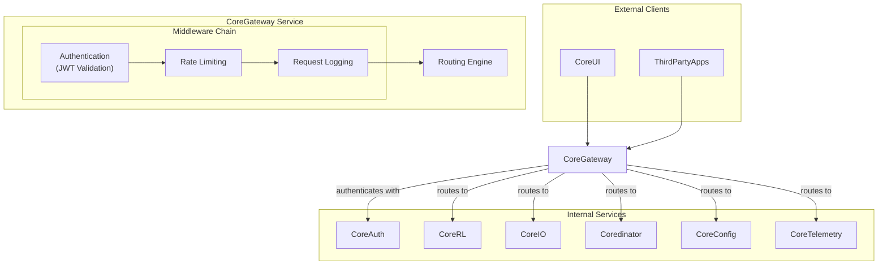
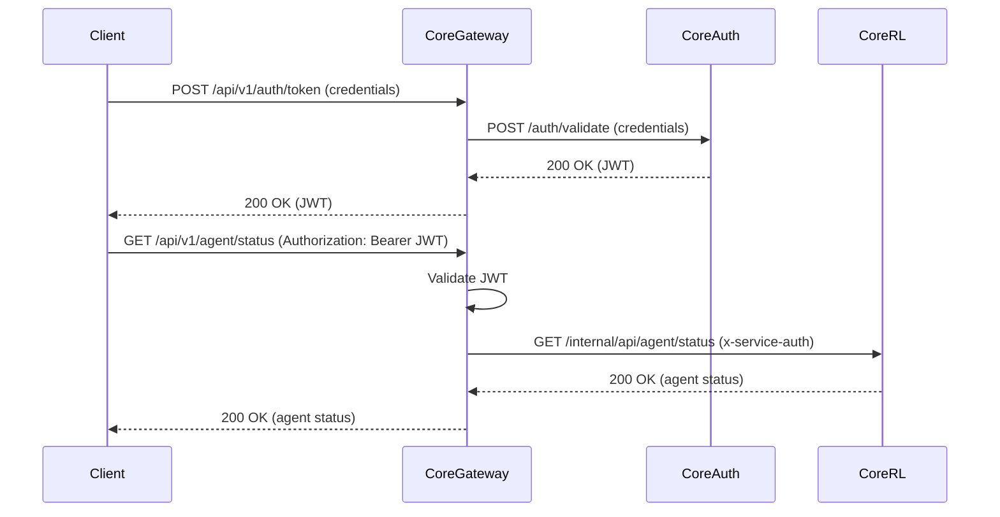

# CoreGateway Service Technical Specification

**Version**: 1.0
**Date**: August 24, 2025
**Status**: Draft

## Summary — Purpose • Scope • Key decisions

- **Purpose**: Provide a single, secure, and stable public REST API entry point for the CoreRL platform. The gateway enforces authentication and rate-limits, routes/forwards requests to internal services, translates (where necessary) between HTTP and internal transports, and stabilizes the public contract while allowing internal services to evolve.
- **Scope**: External-to-internal HTTP routing, authentication enforcement (via CoreAuth), rate limiting and debouncing, API versioning, request/response transformations, simple protocol translation for synchronous calls (HTTP -> HTTP or HTTP -> lightweight ZeroMQ request-reply gateway), health & metrics endpoints.
- Key decisions:
  - `CoreGateway` delegates authentication validation to `CoreAuth`. The gateway enforces token validation and permission checks in middleware.
  - Use Python-based routing configuration for deterministic routing and type safety.
  - Prefer HTTP for internal synchronous request/response paths to reduce complexity; provide a thin ZeroMQ bridge adapter for specific internal services that require it (e.g., CoreRL / CoreIO).
  - Implement gateway as a stateless FastAPI service.

---

## Spec outline

- Context: Edge-of-network reverse-proxy/gateway for CoreRL
- Primary use-cases:
  - UI client obtains JWT via `/api/v1/auth/token`, then calls protected endpoints.
  - Clients call `/api/v1/agent/*` which the gateway routes to `coredinator`.
- NFRs:
  - TLS termination for external traffic
  - P95 API latency < 500ms (gateway overhead target < 50ms)
  - Rate limit: default 100 requests/min; adjustable per-route
  - High availability: readiness/liveness probes for `coredinator`
- Components & responsibilities:
  - HTTP server (FastAPI + ASGI worker)
  - Middleware chain: Auth, Rate-limiter, Logging, Correlation IDs, Request validation
  - Routing Engine (path-prefix -> target service URL)
  - Protocol Adapter (HTTP — primary; ZeroMQ adapter optional)
- Data flows:
  - Client -> Gateway (TLS) -> Auth middleware -> Routing engine -> Internal service (HTTP/zMQ) -> Gateway -> Client
- Deployment:
  - Windows and linux executables managed by `coredinator`
- Assumptions:
  - `CoreAuth` issues JWTs the gateway can validate
  - Internal services are available on cluster network (service names resolvable)
- Acceptance criteria:
  - Gateway routes /auth/token to CoreAuth and returns JWTs successfully
  - Gateway blocks unauthorized requests based on role
  - Rate-limits enforced and reported
  - Gateway defines static routes in code and routes to internal targets

---

## Component diagram



---

## Sequence: authentication + request flow



---

## Configuration & Routing

- Routes are defined as Python dataclasses and can be reloaded via an admin endpoint.
- Example `routes.py`:

```python
from dataclasses import dataclass
from enum import Enum
from typing import Literal

class Role(Enum):
    ADMIN = "admin"
    OPERATIONS = "operations"
    SERVICE = "service"
    EVERYONE = "everyone"

@dataclass
class RateLimit:
    count: int
    unit: Literal["second", "minute", "hour"]

@dataclass
class Route:
    path_prefix: str
    service: str
    target: str
    required_role: Role
    rate_limit: RateLimit

ROUTES = [
    Route(
        path_prefix="/api/v1/agent",
        service="corerl",
        target="http://corerl:8000/api/agent",
        required_role=Role.OPERATIONS,
        rate_limit=RateLimit(200, "minute"),
    ),
    Route(
        path_prefix="/api/v1/config",
        service="coreconfig",
        target="http://coreconfig:8001/api/config",
        required_role=Role.ADMIN,
        rate_limit=RateLimit(60, "minute"),
    ),
    Route(
        path_prefix="/auth",
        service="coreauth",
        target="http://coreauth:8002/auth",
        required_role=Role.EVERYONE,
        rate_limit=RateLimit(20, "minute"),
    ),
]
```

Notes:
- `target` should be a resolvable service URL.
- Path rewriting: by default strip the `path_prefix` and forward the remainder. Optionally the config can map to a different internal path.

---

## API contract & example endpoints

- Public prefix: `/api/v1/`
- Minimal endpoints:
  - `POST /api/v1/auth/token` -> forwards to CoreAuth -> returns JWT
  - `GET /api/v1/agent/status` -> forwards to CoreRL
  - `GET /api/v1/config/current` -> forwards to CoreConfig

Request headers:
- `Authorization: Bearer <jwt>` for protected routes
- `X-Correlation-ID` optionally supplied or generated by the gateway
- `X-Forwarded-For` added for client IP preservation

Responses:
- For proxied 2xx responses, gateway forwards body and essential headers.
- For internal error codes, gateway normalizes errors:
  - Internal service 5xx -> gateway returns 502 Bad Gateway and logs details.
  - Unauthorized or invalid token -> 401
  - Forbidden -> 403
  - Rate-limited -> 429

---

## Authentication patterns

The gateway uses Local JWT validation.
- Gateway receives JWT, validates signature and claims with known public keys (or JWK URI).
- Check expiry, issuer, audience, and roles/permissions in token claims as required.
- This method is fast, with no network roundtrip per request.

Recommendation: Use JWT signed by `CoreAuth` with a short-ish TTL (e.g., 15–60 minutes) and a revocation list or key-rotation strategy coordinated with `CoreAuth`.

---

## Rate limiting & debouncing

- Implement global rate limits using an in-memory sliding window or token-bucket implementation. Per-user or per-IP limits are not required for this on-premise architecture.
- Debouncing: endpoints that trigger expensive operations (e.g., training start) should be subject to a short debounce window to coalesce duplicate requests.

---

## Protocol translation (HTTP <> ZeroMQ)

- Primary plan: use HTTP for synchronous requests.
- If internal service only exposes ZeroMQ request/reply, create a small adapter module in the gateway:
  - Adapter receives HTTP request, maps to ZeroMQ message, performs request/reply with timeout, converts ZeroMQ reply to HTTP.
  - Keep adapter isolated and small; prefer to move services to HTTP facades if adapter complexity grows.

Edge cases:
- Timeouts and partial failures: use circuit breaker pattern and return appropriate HTTP codes.

---

## Observability & metrics

- **Metrics**: The gateway pushes key operational metrics directly to the `CoreTelemetry` service. This includes:
  - `request_total`, `request_duration_seconds` (histogram), `request_size_bytes`, `response_size_bytes`
  - `auth_validation_total`, `auth_failures_total`
  - `rate_limited_total`
  - `proxied_5xx_total`
- **Logging**: Structured JSON logs with correlation id, request path, method, response code, latency, and user id are emitted for centralized collection.

---

## Deployment & operations

- **Orchestration**: The `CoreGateway` service is managed by the `coredinator` orchestration layer, which is responsible for its lifecycle (start, stop, restart).
- **Installation**: The service is deployed as a bare-metal executable on both Windows and Linux servers.
- **Health Checks**: `coredinator` monitors the health of the `CoreGateway` via a `/healthcheck` endpoint.
- **Secrets Management**: JWT verification keys and other secrets are managed via encrypted configuration files.

---

## Error handling & resilience

- Circuit breaker around each internal target: short-circuit requests to failing services and return 503 with a clear message.
- Configurable timeout for proxied calls (default 2s).
- Retries: idempotent GET/HEAD/PUT only, with exponential backoff and jitter; do not retry POST by default.

---

## Pseudocode / API contract (gateway routing logic)

- Inputs:
  - HTTP request: method, path, headers, body
  - `routes.py` dataclasses
- Outputs:
  - HTTP response to client
- Errors:
  - 401 unauthorized
  - 403 forbidden
  - 429 rate limit
  - 502/503 gateway/service errors

Pseudocode:

```python
def handle_request(req):
    route = route_table.find(req.path)
    if not route:
        return 404

    token = extract_bearer(req.headers)
    claims = validate_jwt(token) # returns None if invalid

    # Everyone can access routes with required_role == Role.EVERYONE, even without a valid token
    if route.required_role != Role.EVERYONE:
        if not claims:
            return 401 # Unauthorized

        user_roles = claims.get("roles", [])
        if route.required_role.value not in user_roles:
            return 403 # Forbidden

    if is_rate_limited(user_or_ip(req)):
        return 429
    # rewrite path and forward
    internal_url = route.target + strip_prefix(req.path, route.path_prefix)
    try:
        resp = http_client.request(req.method, internal_url, headers=filtered_headers(req.headers), data=req.body, timeout=route.timeout)
        return normalize_response(resp)
    except TimeoutError:
        return 504
    except ConnectionError:
        return 502
```

---

## Acceptance tests (minimal)

1. Auth flow:
   - POST /api/v1/auth/token -> gateway forwards to coreauth and returns JWT.
   - GET protected endpoint without token -> gateway returns 401.
   - GET protected endpoint with valid token -> gateway proxies request to target and returns 200.

2. Rate limiting:
   - Send N requests over limit -> gateway returns 429 for the excess requests.

3. Routing:
   - Request /api/v1/agent/xyz -> gateway forwards to corerl target with path rewritten.

4. Error handling:
   - Internal service 5xx -> gateway returns 502 and increments metric proxied_5xx_total.

---

## Risks & mitigations

- Risk: Key rotation invalidates active tokens -> Mitigation: support JWK rotation with cache and grace period.
- Risk: Gateway becomes single point of failure -> Mitigation: `coredinator` monitors the service's health via its health check endpoint and automatically restarts it upon failure.

---
*This document is maintained by the CoreRL engineering team.*
