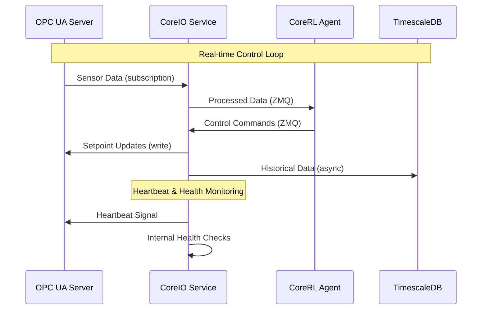

# CoreIO Service Technical Specification

## Overview

CoreIO is the I/O service for communication between the CoreRL system and external industrial control systems. It provides data exchange using the OPC UA protocol.

## Architecture

### Core Responsibilities
- **Data Ingress**: Reading sensor data from OPC UA servers
- **Control Output**: Writing setpoints and control commands
- **Real-time Communication**: Sub-second data exchange cycles
- **Security**: Encrypted and authenticated industrial communications
- **Protocol Translation**: Converting between OPC UA and internal data formats

### Service Design
CoreIO uses an async-first architecture to handle multiple concurrent OPC UA connections.

## Technical Implementation

### OPC UA Integration

### ZeroMQ Integration

CoreIO uses ZeroMQ for messaging with other services.

## Data Flow Architecture

## API Endpoints

### Health Check
The health check API provides an endpoint to verify the service is running and connected.

### Metrics & Status
The metrics and status API returns operational metrics, including OPC UA connection status, latency, and error rates.

## Security Implementation

### OPC UA Security
CoreIO implements OPC UA security features:

#### Authentication
- **X.509 Certificates**: Mutual authentication
- **Session Encryption**: Data encrypted in transit
- **Session Management**: Secure session handling

### Network Security
- **TLS Encryption**: Communications encrypted with TLS 1.3
- **Network Segmentation**: Industrial network isolation
- **Firewall Rules**: Port access and IP whitelisting

## Reliability Features
- **Connection Recovery**: Automatic reconnection with backoff
- **Data Validation**: Input validation
- **Graceful Degradation**: Fallback modes for communication failures

## Monitoring and Observability

### Key Metrics
- **Connection Health**: OPC UA connection status
- **Latency Metrics**: Read/write timing
- **Error Rates**: Failed operations, timeouts

### Alerts
- **Connection Loss**: OPC UA disconnection
- **High Latency**: Communication delays
- **Security Events**: Authentication failures, certificate issues

## Deployment Considerations

### Resource Requirements
- **CPU**: 2+ cores
- **Memory**: 2GB
- **Network**: Low-latency connection to OPC UA servers
- **Storage**: 1TB+ for plant data

### Deployment
The CoreIO service is deployed as a bare-metal executable on Windows or Linux. Its lifecycle is managed by the `coredinator` service. Configuration is handled via local YAML files, and data is persisted to survive restarts.
