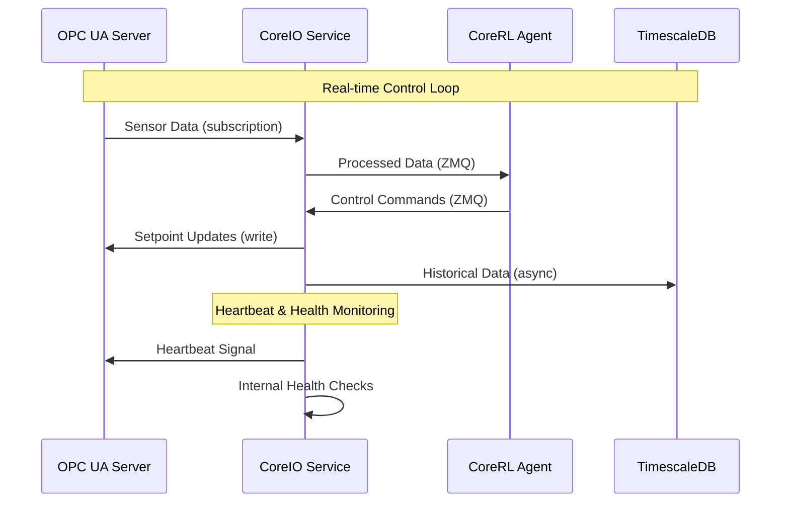

# CoreIO Service Technical Specification

## Overview

CoreIO is the industrial I/O service responsible for all communication between the CoreRL system and external industrial control systems. It provides secure, reliable, and high-performance data exchange using industry-standard OPC UA protocol.

## Architecture

### Core Responsibilities
- **Data Ingress**: Reading sensor data from OPC UA servers
- **Control Output**: Writing setpoints and control commands
- **Real-time Communication**: Sub-second data exchange cycles
- **Security**: Encrypted and authenticated industrial communications
- **Protocol Translation**: Converting between OPC UA and internal data formats

### Service Design
CoreIO is built with an async-first architecture to handle multiple concurrent OPC UA connections efficiently:

## Technical Implementation

### OPC UA Integration

### ZeroMQ Integration

CoreIO uses ZeroMQ for high-performance messaging with other services:

## Data Flow Architecture



## API Endpoints

### Health Check
```http
GET /api/healthcheck
```
Returns a simple `200 OK` if the service is running and connected.

### Metrics & Status
```http
GET /api/metrics
```
Returns detailed operational metrics, including OPC UA connection status, latency, and error rates.

## Security Implementation

### OPC UA Security
CoreIO implements comprehensive OPC UA security features:

#### Authentication
- **X.509 Certificates**: Mutual authentication between client and server
- **Session Encryption**: All data encrypted in transit
- **Session Management**: Secure session establishment and renewal

### Network Security
- **TLS Encryption**: All communications encrypted with TLS 1.3
- **Network Segmentation**: Industrial network isolation
- **Firewall Rules**: Restricted port access and IP whitelisting

## Reliability Features
- **Connection Recovery**: Automatic reconnection with exponential backoff
- **Data Validation**: Input validation and sanitization
- **Graceful Degradation**: Fallback modes during communication failures


## Monitoring and Observability

### Key Metrics
- **Connection Health**: OPC UA connection status and uptime
- **Latency Metrics**: Read/write operation timing
- **Error Rates**: Failed operations, timeout incidents

### Alerts
- **Connection Loss**: OPC UA server disconnection
- **High Latency**: Communication delays > threshold
- **Security Events**: Authentication failures, certificate issues

## Deployment Considerations

### Resource Requirements
- **CPU**: 2+ cores for async operations
- **Memory**: 2GB for connection pooling and buffering
- **Network**: Low-latency network connection to OPC UA servers
- **Storage**: 1TB+ for historized plant data

### Deployment
The CoreIO service is deployed as a bare-metal executable on Windows or Linux. Its lifecycle, including high availability and automatic restarts, is managed by the `coredinator` service. Configuration is handled via local YAML files, and critical data is persisted to survive restarts.
