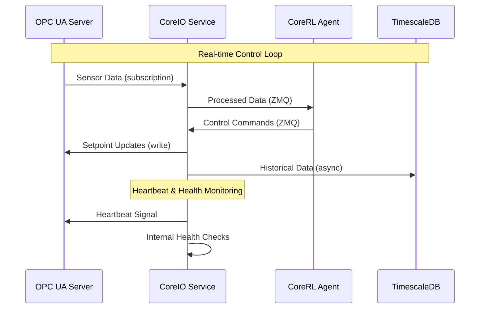

# CoreIO Service Technical Specification

## Overview

CoreIO is the industrial I/O service responsible for all communication between the CoreRL system and external industrial control systems. It provides secure, reliable, and high-performance data exchange using industry-standard OPC UA protocol.

## Architecture

### Core Responsibilities
- **Data Ingress**: Reading sensor data from OPC UA servers
- **Control Output**: Writing setpoints and control commands
- **Real-time Communication**: Sub-second data exchange cycles
- **Security**: Encrypted and authenticated industrial communications
- **Protocol Translation**: Converting between OPC UA and internal data formats

### Service Design
CoreIO is built with an async-first architecture to handle multiple concurrent OPC UA connections efficiently:

```python
# Async-first design example
async def coreio_loop():
    """Main asynchronous event loop for CoreIO service."""
    while True:
        # Concurrent data operations
        await asyncio.gather(
            read_sensor_data(),
            write_control_commands(),
            send_heartbeat(),
            process_alarms()
        )
```

## Technical Implementation

### OPC UA Integration

#### Client Configuration
```python
from asyncua import Client

async def setup_opc_client():
    client = Client("opc.tcp://admin@opc-server:4840/rlcore/server/")
    
    # Security configuration
    await client.set_security_string("Basic256Sha256,SignAndEncrypt,certificate.pem,private_key.pem")
    
    # Connection with authentication
    await client.connect()
    return client
```

#### Data Subscription
CoreIO implements OPC UA subscriptions for real-time data updates:

```python
class DataChangeHandler:
    async def datachange_notification(self, node, val, data):
        """Handle real-time data changes from OPC UA server."""
        timestamp = data.monitored_item.Value.ServerTimestamp
        await self.process_sensor_update(node.nodeid, val, timestamp)
```

### ZeroMQ Integration

CoreIO uses ZeroMQ for high-performance messaging with other services:

```python
import zmq.asyncio

class ZMQCommunicator:
    def __init__(self):
        self.context = zmq.asyncio.Context()
        self.subscriber = self.context.socket(zmq.SUB)
        self.publisher = self.context.socket(zmq.PUB)
    
    async def publish_sensor_data(self, data):
        """Publish sensor data to CoreRL agents."""
        await self.publisher.send_multipart([
            b"sensor_data",
            json.dumps(data).encode()
        ])
```

## Data Flow Architecture



## Configuration

### Connection Configuration
```yaml
coreio:
  opc_ua:
    endpoint: "opc.tcp://admin@opc-server:4840/rlcore/server/"
    security_mode: "SignAndEncrypt"
    security_policy: "Basic256Sha256"
    certificate_path: "/app/certs/client.pem"
    private_key_path: "/app/certs/private_key.pem"
    
  zmq:
    publisher_port: 5555
    subscriber_port: 5556
    
  data_sources:
    temperature_sensors:
      - node_id: "ns=2;i=2"
        tag_name: "reactor_temp"
        data_type: "float"
        unit: "celsius"
        
    control_outputs:
      - node_id: "ns=2;i=10"
        tag_name: "pump_speed"
        data_type: "float"
        unit: "percent"
        min_value: 0.0
        max_value: 100.0
```

### Performance Tuning
```yaml
performance:
  subscription_interval: 100  # milliseconds
  batch_size: 50
  max_concurrent_writes: 10
  connection_timeout: 30
  retry_attempts: 3
  backoff_multiplier: 2.0
```

## API Endpoints

### Health and Status
```http
GET /api/coreio/health
```
Returns service health, OPC UA connection status, and communication metrics.

### Connection Management
```http
POST /api/coreio/connections/opc
GET /api/coreio/connections/status
DELETE /api/coreio/connections/{connection_id}
```

### Data Operations
```http
GET /api/coreio/data/current
POST /api/coreio/data/write
GET /api/coreio/data/history?start={timestamp}&end={timestamp}
```

### Diagnostic Tools
```http
GET /api/coreio/diagnostics/latency
GET /api/coreio/diagnostics/throughput
POST /api/coreio/diagnostics/test_connection
```

## Security Implementation

### OPC UA Security
CoreIO implements comprehensive OPC UA security features:

#### Certificate Management
```python
class CertificateManager:
    def __init__(self, cert_path: str, key_path: str):
        self.certificate = self.load_certificate(cert_path)
        self.private_key = self.load_private_key(key_path)
    
    async def establish_secure_channel(self, client):
        """Establish encrypted OPC UA channel with certificate authentication."""
        await client.set_security(
            self.certificate,
            self.private_key,
            certificate_handler=self.validate_server_certificate
        )
```

#### Authentication
- **X.509 Certificates**: Mutual authentication between client and server
- **Session Encryption**: All data encrypted in transit
- **Session Management**: Secure session establishment and renewal

### Network Security
- **TLS Encryption**: All communications encrypted with TLS 1.3
- **Network Segmentation**: Industrial network isolation
- **Firewall Rules**: Restricted port access and IP whitelisting

## Performance Characteristics

### Latency Requirements
- **Data Read**: < 50ms from OPC UA to internal processing
- **Control Write**: < 100ms from command to OPC UA server
- **End-to-End**: < 200ms from sensor to actuator

### Throughput Capabilities
- **Sensor Data**: 1000+ tags/second reading capacity
- **Control Commands**: 100+ writes/second sustained
- **Concurrent Connections**: 10+ OPC UA servers simultaneously

### Reliability Features
- **Connection Recovery**: Automatic reconnection with exponential backoff
- **Data Validation**: Input validation and sanitization
- **Graceful Degradation**: Fallback modes during communication failures

## Integration Testing

### Manual E2E Testing
For comprehensive testing, CoreIO provides a manual testing workflow:

```bash
# Terminal 1: Start OPC UA server
uaserver --populate

# Terminal 2: Start OPC UA client for monitoring
uv run opcua-client

# Terminal 3: Start CoreIO service
uv run python coreio/main.py --config-name coreio_test_config.yaml

# Terminal 4: Start dummy agent for testing
uv run python coreio/dummy_agent.py --config-name coreio-test-config.yaml
```

### Automated Testing
```bash
# Integration tests
uv run pytest test/large/smoke/test_dep_mountain_car_continuous.py

# Performance benchmarks
uv run pytest test/benchmarks/test_coreio_throughput.py
```

## Monitoring and Observability

### Key Metrics
- **Connection Health**: OPC UA connection status and uptime
- **Data Throughput**: Messages per second, bytes transferred
- **Latency Metrics**: Read/write operation timing
- **Error Rates**: Failed operations, timeout incidents

### Logging
```python
import structlog

logger = structlog.get_logger("coreio")

async def process_data(node_id: str, value: float):
    logger.info(
        "processing_sensor_data",
        node_id=node_id,
        value=value,
        timestamp=time.time(),
        correlation_id=correlation_id
    )
```

### Alerts
- **Connection Loss**: OPC UA server disconnection
- **High Latency**: Communication delays > threshold
- **Data Quality**: Invalid or stale sensor readings
- **Security Events**: Authentication failures, certificate issues

## Deployment Considerations

### Resource Requirements
- **CPU**: 2+ cores for async operations
- **Memory**: 4GB+ for connection pooling and buffering
- **Network**: Low-latency network connection to OPC UA servers
- **Storage**: 10GB+ for logs and temporary data

### High Availability
- **Service Redundancy**: Active-passive failover configuration
- **Data Persistence**: Critical data persisted to survive restarts
- **Health Monitoring**: Continuous health checks and automatic recovery

### Docker Configuration
```dockerfile
FROM python:3.13-slim

# Install system dependencies for OPC UA
RUN apt-get update && apt-get install -y \
    build-essential \
    libffi-dev \
    libssl-dev \
    && rm -rf /var/lib/apt/lists/*

# Install Python dependencies
COPY requirements.txt .
RUN pip install -r requirements.txt

# Copy application code
COPY coreio/ /app/coreio/
WORKDIR /app

# Runtime configuration
EXPOSE 8001
CMD ["python", "-m", "coreio.main"]
```

## Troubleshooting Guide

### Common Issues

#### OPC UA Connection Failures
**Symptoms**: Cannot connect to OPC UA server
**Causes**: 
- Network connectivity issues
- Certificate problems
- Security policy mismatches

**Solutions**:
```bash
# Test network connectivity
ping opc-server-ip

# Validate certificates
openssl x509 -in certificate.pem -text -noout

# Check OPC UA server endpoints
uaclient --discover opc.tcp://server:4840
```

#### High Latency
**Symptoms**: Data read/write operations > 100ms
**Causes**:
- Network congestion
- OPC UA server overload
- Large subscription intervals

**Solutions**:
- Reduce subscription interval
- Implement connection pooling
- Optimize data batching

#### Memory Leaks
**Symptoms**: Increasing memory usage over time
**Causes**:
- Unclosed OPC UA connections
- Growing message queues
- Circular references in async code

**Solutions**:
```python
# Proper connection cleanup
async def cleanup_connections():
    for connection in self.connections:
        await connection.disconnect()
    self.connections.clear()
```

### Debugging Tools
```python
# Enable OPC UA debugging
import logging
logging.getLogger("asyncua").setLevel(logging.DEBUG)

# Performance profiling
import asyncio
import time

async def profile_operation(operation):
    start = time.time()
    result = await operation()
    duration = time.time() - start
    logger.info(f"Operation took {duration:.3f}s")
    return result
```

## Future Enhancements

### Planned Features
- **Multi-Protocol Support**: MQTT, Modbus, EtherNet/IP
- **Edge Computing**: Local processing capabilities
- **Data Compression**: Optimized data transmission
- **Predictive Maintenance**: Connection health prediction

### Performance Improvements
- **Connection Pooling**: Reuse OPC UA connections
- **Async Batching**: Batch multiple operations
- **Caching Layer**: Local data caching for reliability