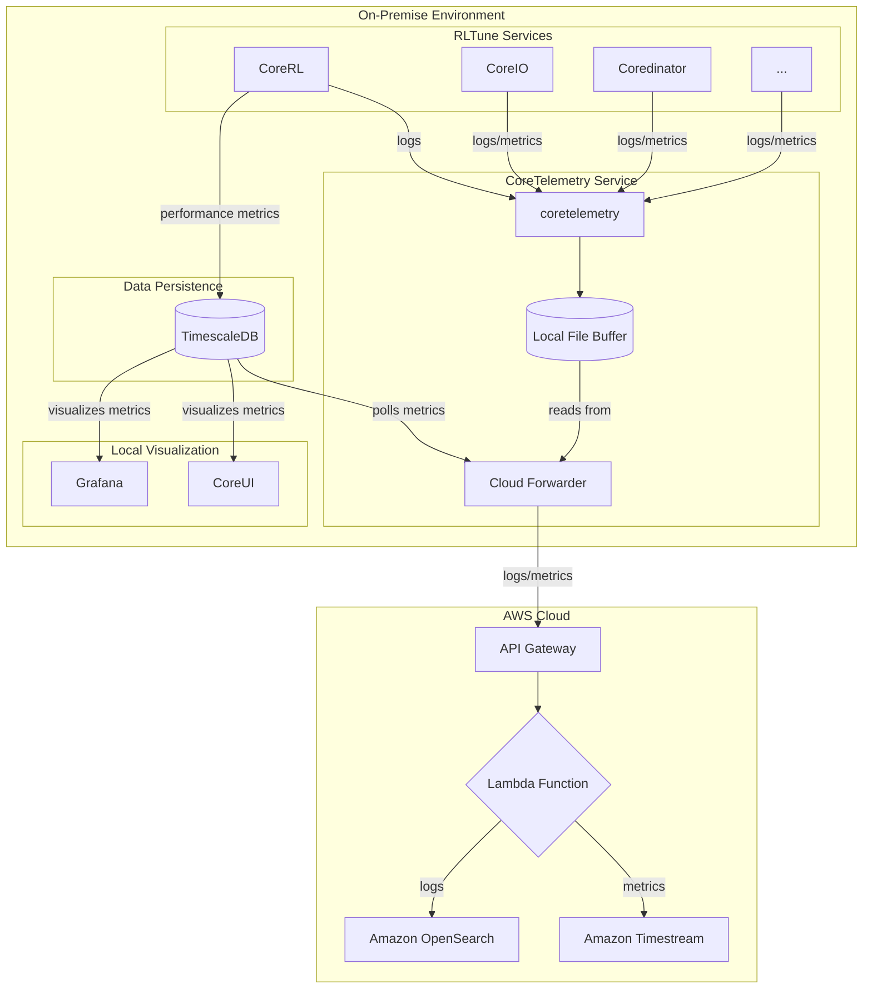

# CoreTelemetry Service Technical Specification

**Version**: 1.0
**Date**: August 25, 2025
**Status**: Draft

## 1. Executive Summary

The CoreTelemetry service is a critical component of the RLTune platform, responsible for collecting, storing, and forwarding all telemetry data, including logs and metrics from all microservices. It is designed to operate reliably in environments with intermittent or no internet connectivity, ensuring that valuable diagnostic and performance data is never lost. In connected environments, it forwards data to a centralized cloud backend for platform-wide observability and analytics.

### Key Features
- **Unified Telemetry Pipeline**: A single service for collecting logs and metrics.
- **Offline-First Design**: Guarantees data integrity and collection even without internet access.
- **Local Data Buffering**: Stores data locally and forwards it to the cloud when connectivity is available.
- **Resilient Data Forwarding**: Employs robust retry mechanisms to handle network interruptions.
- **Scalable and Performant**: Built to handle high-volume telemetry streams with low overhead.
- **Cloud Integration**: Seamlessly integrates with AWS for long-term storage and analysis.

---

## 2. System Architecture

CoreTelemetry is designed as a standalone service that runs alongside other RLTune services. It exposes an API for data ingestion and uses a file-based buffering system managed by Fluentd for local storage and forwarding.

### Component Diagram



### Data Flow

1.  **Log Ingestion**: RLTune services (including the CoreRL service) send structured logs to the `CoreTelemetry` API server via HTTP POST requests.
2.  **Metric Polling**: A background worker in the `Cloud Forwarder` periodically polls the TimescaleDB database to retrieve the latest agent performance metrics.
3.  **Local Buffering**: The API server writes the incoming logs to a local file-based buffer. The polled metrics are also written to a separate buffer.
4.  **Cloud Ingestion**: The `Cloud Forwarder` reads from the buffer files, batches the data, and sends it to a public-facing AWS API Gateway endpoint.
5.  **Processing & Storage**: The API Gateway triggers an AWS Lambda function that receives the data, transforms it into the appropriate format, and ingests it into Amazon OpenSearch (for logs) and Amazon Timestream (for metrics).
6.  **Offline Handling**: If the cloud endpoints are unreachable, the `Cloud Forwarder` will preserve the buffer on disk and automatically retry sending the data when connectivity is restored.
7.  **Data Retention**: Local buffer files are periodically purged by the `Cloud Forwarder` based on a configurable retention policy (e.g., age or total size) to manage disk space.

---

## 3. Technology Stack

| Component | Technology | Purpose |
|-----------|------------|---------|
| **Web Framework** | FastAPI | API for data ingestion |
| **Data Collector** | Custom Cloud Forwarder | Local buffering and data forwarding |
| **Local Storage** | File System | Durable, simple buffer storage |
| **Cloud Ingress** | AWS API Gateway | Public endpoint for telemetry data |
| **Cloud Processing** | AWS Lambda | Data formatting and ingestion |
| **Cloud Backend (Logs)** | Amazon OpenSearch | Centralized logging and analysis |
| **Cloud Backend (Metrics)**| Amazon Timestream | Time-series metrics storage |

---

## 4. API Contract

The CoreTelemetry service exposes a simple, yet effective API for other services to submit their telemetry data.

### Endpoints

#### `POST /v1/logs`
- **Description**: Submits a single log entry.
- **Request Body**:
  ```json
  {
    "timestamp": "2025-08-25T10:00:00Z",
    "service": "corerl",
    "level": "INFO",
    "message": "Agent started successfully.",
    "correlation_id": "abc-123"
  }
  ```
- **Response**: `202 Accepted`

#### `GET /healthcheck`
- **Description**: Standard health check endpoint.
- **Response**: `200 OK` if the API server is running and can write to the local buffer.

---

## 5. Risk Assessment & Mitigation

| Risk | Likelihood | Impact | Mitigation |
| :--- | :--- | :--- | :--- |
| **Local disk space exhaustion** | Medium | High | Implement a strict data retention policy (e.g., 30 days or 100GB). Monitor disk usage and generate alerts. |
| **Data loss during service crash** | Low | High | Use file-based buffering, which is persistent across restarts. Ensure proper shutdown procedures are followed. |
| **Mismatched data schemas** | Low | Medium | Use Pydantic models for strict schema validation at the API ingestion point. |
