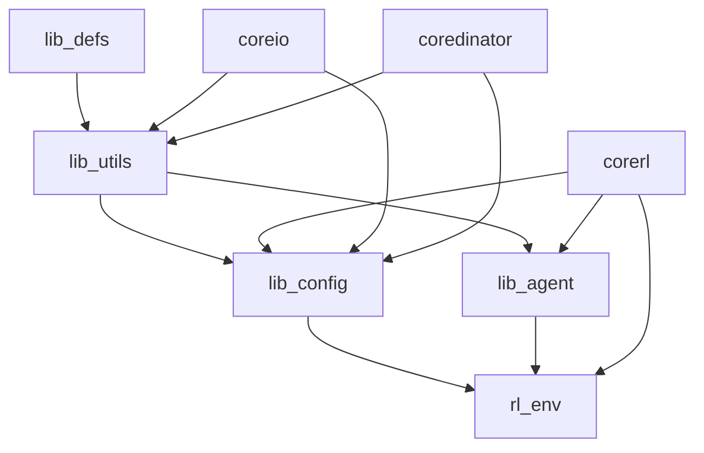

# Shared Libraries Technical Specification

## Overview

The CoreRL system includes several shared libraries that provide common functionality across all microservices. These libraries promote code reuse, maintain consistency, and provide specialized capabilities for reinforcement learning applications.

## Library Architecture

```
libs/
├── lib_agent/        # RL agent components and algorithms
├── lib_config/       # Configuration management and validation
├── lib_utils/        # General utilities and JAX helpers
├── lib_defs/         # Type definitions and constants
└── rl_env/          # RL environments and simulators
```

## lib_agent: RL Agent Components

### Purpose
Provides core reinforcement learning components including neural networks, buffers, critics, and actors that can be shared across different RL implementations.

### Key Components

#### Neural Networks (`lib_agent/network/`)
```python
# High-performance neural networks optimized for RL
from lib_agent.network.networks import MLP, EnsembleNet

# Example usage
network = MLP(
    layers=[256, 256, 128],
    activation="relu",
    output_activation="linear"
)

# JAX-based ensemble networks
ensemble = EnsembleNet(
    base_network=network,
    ensemble_size=5,
    shared_layers=2
)
```

**Features:**
- JAX-based implementations for GPU acceleration
- Ensemble methods for uncertainty estimation
- Configurable activation functions and architectures
- Dropout and batch normalization support

#### Experience Buffers (`lib_agent/buffer/`)
```python
from lib_agent.buffer import RecencyBuffer, MixedHistoryBuffer

# Circular buffer for experience replay
buffer = RecencyBuffer(
    capacity=100000,
    transition_type=JaxTransition
)

# Add transitions
buffer.feed(transitions, data_mode="online")

# Sample batches for training
batch = buffer.sample(batch_size=256)
```

**Buffer Types:**
- **RecencyBuffer**: FIFO circular buffer for recent experiences
- **MixedHistoryBuffer**: Prioritized sampling from different time periods
- **Storage**: Efficient JAX array storage with automatic memory management

#### Actor Networks (`lib_agent/actor/`)
```python
from lib_agent.actor import PercentileActor

actor = PercentileActor(
    state_dim=10,
    action_dim=4,
    network_config=network_config,
    learning_config=actor_config
)

# Generate actions with uncertainty
actions, metrics = actor.get_actions(
    params=actor_params,
    state=current_state,
    rng=jax_rng
)
```

**Features:**
- **Percentile-based Policy**: Robust policy learning with percentile objectives
- **Continuous Control**: Gaussian and other continuous action distributions
- **JAX Optimization**: JIT-compiled for high performance

#### Critic Networks (`lib_agent/critic/`)
```python
from lib_agent.critic import QRCCritic

critic = QRCCritic(
    state_dim=10,
    action_dim=4,
    ensemble_size=5,
    quantile_config=quantile_config
)

# Value estimation with uncertainty
values = critic.get_values(
    params=critic_params,
    state=states,
    action=actions,
    rng=rng
)
```

**Critic Types:**
- **QRCCritic**: Quantile regression critic for distributional RL
- **Ensemble Methods**: Multiple critics for robust value estimation
- **Rolling Reset**: Automatic network resets to prevent overfitting

### Data Types
```python
from lib_agent.buffer.datatypes import JaxTransition

@dataclass
class JaxTransition:
    state: jax.Array
    action: jax.Array
    reward: jax.Array
    next_state: jax.Array
    gamma: jax.Array
    action_lo: jax.Array
    action_hi: jax.Array
    # ... additional fields for RL
```

## lib_config: Configuration Management

### Purpose
Provides robust configuration management with validation, type safety, and dynamic updates for all services.

### Core Features

#### Type-Safe Configuration
```python
from lib_config import config
from pydantic import BaseModel

class AgentConfig(BaseModel):
    learning_rate: float = 0.0003
    batch_size: int = 256
    ensemble_size: int = 5
    
    class Config:
        validate_assignment = True

# Load and validate configuration
@config
def agent_config() -> AgentConfig:
    return AgentConfig()
```

#### Hierarchical Configuration
```python
# Support for nested configurations
@config
def experiment_config():
    return {
        "agent": agent_config(),
        "environment": env_config(),
        "training": training_config()
    }
```

#### Dynamic Configuration Updates
```python
from lib_config.loader import ConfigLoader

loader = ConfigLoader()

# Watch for configuration changes
async def config_watcher():
    async for config_update in loader.watch_changes():
        await update_service_config(config_update)
```

### Configuration Validation
- **Schema Validation**: Pydantic-based type checking
- **Business Logic Validation**: Custom validation rules
- **Environment-Specific Overrides**: Dev/staging/prod configurations

## lib_utils: General Utilities

### Purpose
Provides common utilities, especially JAX-related helpers, that are used across the entire system.

### JAX Utilities (`lib_utils/jax.py`)

#### JIT Compilation Helpers
```python
import lib_utils.jax as jax_u

# Method JIT compilation
class MyClass:
    @jax_u.method_jit
    def compute(self, x: jax.Array) -> jax.Array:
        return jnp.sum(x ** 2)

# Function JIT with static arguments
@jax_u.jit
def process_batch(data: jax.Array, batch_size: int) -> jax.Array:
    return jnp.reshape(data, (batch_size, -1))
```

#### Advanced Vectorization
```python
# Selective vectorization with exclusions
@jax_u.vmap_only(include=["data"], exclude=["params"])
def apply_model(params, data, config):
    # params and config not vectorized, only data
    return model.apply(params, data)

# Multi-level vectorization
@jax_u.multi_vmap(levels=2)
def process_ensemble_batch(data):
    # Vectorize over both ensemble and batch dimensions
    return neural_network(data)
```

#### Gradient Utilities
```python
# Gradient computation with auxiliary data
@jax_u.grad(has_aux=True)
def loss_with_metrics(params, data):
    loss = compute_loss(params, data)
    metrics = compute_metrics(params, data)
    return loss, metrics

loss, grads = loss_with_metrics(params, data)
```

### Data Utilities
```python
from lib_utils import dict, list, maybe

# Dictionary utilities
result = dict.deep_merge(config1, config2)
nested_value = dict.nested_get(data, "path.to.value")

# List utilities
chunked = list.chunk(large_list, chunk_size=100)
flattened = list.flatten_nested(nested_list)

# Maybe/Optional utilities
value = maybe.chain(
    maybe.from_optional(optional_value),
    lambda x: x * 2,
    lambda x: x + 1
)
```

### Error Handling
```python
from lib_utils.errors import ConfigurationError, ValidationError

class CustomError(ValidationError):
    """Custom domain-specific error."""
    pass

# Context managers for error handling
with lib_utils.error_context("Processing batch"):
    result = process_data(batch)
```

## lib_defs: Type Definitions

### Purpose
Provides shared type definitions, constants, and interfaces used across all services.

### Common Types
```python
from lib_defs.types import (
    StateArray,
    ActionArray,
    RewardArray,
    Timestamp,
    ConfigDict
)

# Type aliases for clarity
StateArray = jax.Array  # Shape: (state_dim,)
ActionArray = jax.Array  # Shape: (action_dim,)
BatchedStates = jax.Array  # Shape: (batch_size, state_dim)
```

### Protocol Definitions
```python
from lib_defs.protocols import Agent, Environment, Buffer

class Agent(Protocol):
    def get_action(self, state: StateArray) -> ActionArray: ...
    def update(self, transitions: Sequence[Transition]) -> Metrics: ...

class Environment(Protocol):
    def step(self, action: ActionArray) -> Tuple[StateArray, float, bool]: ...
    def reset(self) -> StateArray: ...
```

### Constants and Enums
```python
from lib_defs.constants import (
    DEFAULT_LEARNING_RATE,
    MAX_EPISODE_LENGTH,
    DataMode
)

from enum import Enum

class DataMode(Enum):
    ONLINE = "online"
    OFFLINE = "offline"
    MIXED = "mixed"
```

## rl_env: RL Environments

### Purpose
Provides standardized RL environments for testing, simulation, and training.

### Environment Types

#### Industrial Simulators
```python
from rl_env import FourRooms, DistractionWorld

# Grid world environment for testing
env = FourRooms(
    size=(11, 11),
    goal_position=(10, 10),
    obstacles=[(5, 5), (6, 6)]
)

# Complex distraction environment
distraction_env = DistractionWorld(
    base_env=env,
    distraction_level=0.3,
    noise_std=0.1
)
```

#### Process Control Environments
```python
from rl_env.factory import create_environment

# Create environment from configuration
env = create_environment(
    env_type="continuous_control",
    config={
        "state_dim": 10,
        "action_dim": 4,
        "control_frequency": 10.0,  # Hz
        "constraints": {
            "power_limit": 1000.0,
            "safety_bounds": [-5.0, 5.0]
        }
    }
)
```

#### Calibration Environments
```python
from rl_env.calibration import CalibrationEnvironment

# Environment for agent calibration
cal_env = CalibrationEnvironment(
    reference_controller=reference_policy,
    performance_metrics=["efficiency", "stability"],
    calibration_targets={
        "efficiency": 0.95,
        "stability": 0.01
    }
)
```

### Environment Features
- **Gymnasium Integration**: Compatible with OpenAI Gym interface
- **JAX Backend**: High-performance simulation with JAX
- **Configurable Dynamics**: Parameterizable environment physics
- **Noise Models**: Realistic sensor noise and disturbances
- **Safety Constraints**: Built-in safety checking and constraint enforcement

## Integration and Dependencies

### Dependency Graph


### Version Management
Each library maintains semantic versioning and compatibility:

```toml
[project]
name = "lib-agent"
version = "0.144.0"
dependencies = [
    "lib-utils[jax]",
    "lib-config",
    "lib-defs"
]
```

### Local Development
```bash
# Install libraries in editable mode
cd libs/lib_agent/
uv sync --dev

# Run library tests
uv run pytest tests/

# Type checking
uv run pyright lib_agent/
```

## Testing Strategy

### Unit Testing
Each library has comprehensive unit tests:

```bash
# Test specific library
cd libs/lib_agent/
uv run pytest tests/buffer/test_recency_buffer.py

# Test with coverage
uv run pytest tests/ --cov=lib_agent --cov-report=html
```

### Integration Testing
Cross-library integration tests ensure compatibility:

```python
# Example integration test
def test_agent_buffer_integration():
    buffer = RecencyBuffer(capacity=1000, transition_type=JaxTransition)
    agent = PercentileActor(...)
    
    # Test that agent can use buffer data
    transitions = generate_test_transitions()
    buffer.feed(transitions, DataMode.ONLINE)
    
    batch = buffer.sample(256)
    agent.update(batch)
    
    assert agent.training_step > 0
```

### Performance Testing
```python
# Benchmark critical library functions
@pytest.mark.benchmark
def test_buffer_performance(benchmark):
    buffer = RecencyBuffer(capacity=100000)
    transitions = generate_large_batch(10000)
    
    result = benchmark(buffer.feed, transitions, DataMode.ONLINE)
    assert result is not None
```

## Best Practices

### Library Design Principles
1. **Single Responsibility**: Each library has a clear, focused purpose
2. **Minimal Dependencies**: Avoid circular dependencies between libraries
3. **Type Safety**: Comprehensive type hints and validation
4. **Performance**: JAX-optimized implementations where appropriate
5. **Testability**: Extensive test coverage and clear interfaces

### Usage Guidelines
1. **Import Organization**: Use specific imports to minimize dependencies
2. **Configuration**: Leverage lib_config for all configurable parameters
3. **Error Handling**: Use lib_utils error handling patterns
4. **Performance**: Use JAX utilities for performance-critical code
5. **Type Hints**: Always use type definitions from lib_defs

### Development Workflow
1. **Library Changes**: Test changes across all dependent services
2. **Version Updates**: Coordinate version bumps across libraries
3. **Breaking Changes**: Follow deprecation timeline for API changes
4. **Documentation**: Maintain comprehensive API documentation